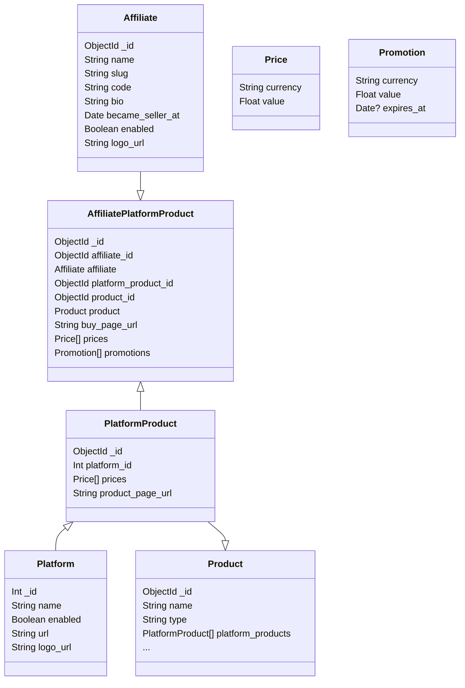

# Affiliates

## Schema 



## Endpoints

### Products

We will introduce a new field `platform_products` that will make part of a product. This field will contain embed documents rather than IDs.

We need to adjust the current model, so that when creating, it will contain an empty array.
Also, we will need a few endpoints to attach a platform product.

**POST /v1/admin/products/:product_id/platform_products**

Attach a platform product.

```json
{
    "platform_id": 1,
    "prices": [{
        "currency": "USD",
        "value": 12.99
    }],
    "product_page_url": "https://example.com"
    // ...
    // we will define the rest of the fields soon
}
```

**DELETE /v1/admin/products/:product_id/platform_products/:platform_product_id**

Delete a platform product

**PATCH /v1/admin/products/:product_id/platform_products/:platform_product_id**

```json
{
    "product_page_url": "https://edited.com"
}
```

### Affiliates

**GET /v1/admin/affiliates**

List all affiliates. (admin)

**GET /v1/affiliates**

List all affiliates. (public)

**GET /v1/admin/affiliates/:slug**

Get an affiliate by slug. (admin)

**GET /v1/affiliates/:slug**

Get an affiliate by slug. (public)

**POST /v1/admin/affiliates**

Create an affiliate.

```json
{
    // required
    "name": "John Park",
    "code": "JOHNGAMES",
    "bio": "Hello, I'm John.",
    "became_seller_at": "2023-01-01T12:30:00Z",
    "logo_url": "https://images.com/logo.png",
    // optional
    "enabled": false
}
```

**DELETE /v1/admin/affiliates/:affiliate_id**

Delete an affiliate.

**PATCH /v1/admin/affiliates/:affiliate_id**

Patch an affiliate.

```json
{
    // all fields are optional
    "name": "John Park",
    "code": "JOHNGAMES",
    "bio": "Hello, I'm John.",
    "became_seller_at": "2023-01-01T12:30:00Z",
    "logo_url": "https://images.com/logo.png",
    "enabled": true
}
```

### Affiliate platform products

**POST /v1/admin/affiliates/:affiliate_id/platform_products**

Attach a platform product to an affiliate.

```json
{
    "product_id": "abcdefghijklmnop",
    "platform_product_id": "abcdefghijklmnop",
    "buy_page_url": "https://example.com"
}
```

**GET /v1/admin/affiliates/:affiliate_id/platform_products**

List platform products for an affiliate.

**DELETE /v1/admin/affiliate_platform_products/:affiliate_platform_product_id**

Detach a platform product from an affiliate.

**PATCH /v1/admin/affiliate_platform_products/:affiliate_platform_product_id**

Patch a platform product on an affiliate.

```json
{
    // all fields are optional
    "buy_page_url": "https://example.com",
    "prices": [
        {
            "currency": "USD",
            "value": 12.99
        }
    ],
    "promotions": [
        {
            "currency": "USD",
            "value": 9.99,
            "expires_at": "2024-04-05T00:00:00Z"
        }
    ]
}
```

**GET /v1/products/:product_id/affiliate_platform_products**

List affiliate platform products for a product. (public)